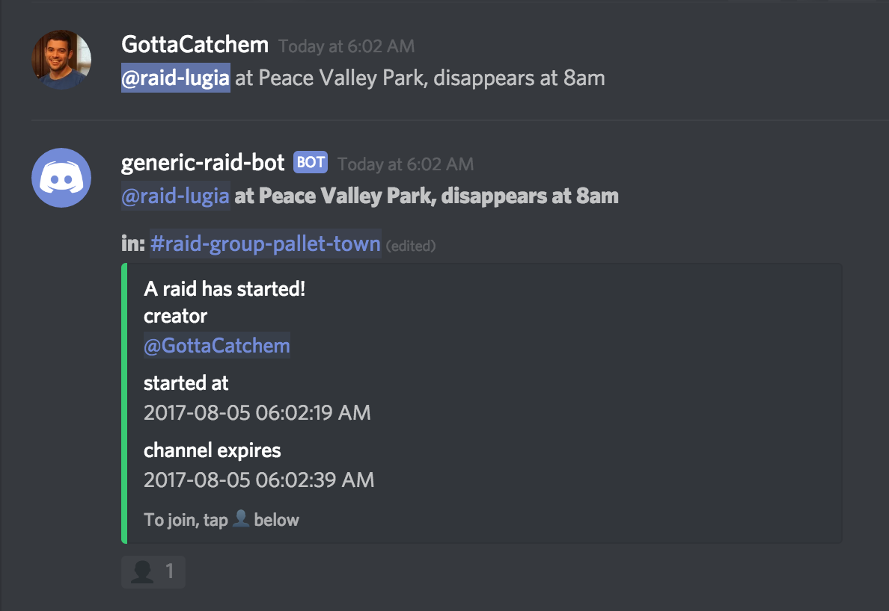

# Raid Coordinator

## Why?

Many Pokemon Go players use discord. Discord lacks threaded conversations. Once your discord server gets about a few hundred members, coordinating raids becomes a challenge. Noise dominates, no one can figure out what is going on. This bot attempts to solve the problem by creating private raid channels and isolating relevant conversations.

This bot uses a convention for managing raids that has worked well for our group. Someone announces the raid in a channel for which the bot has read messages permission. The bot looks for messages with role mentions matching a certain pattern. 

The bot will announce the raid and open up a private channel for discussing the raid. Other users may enter by reacting to this announcement with an emoji.

## Features

- Users can join / leave the raid at any time. 
- Channels automatically expire after 2 hours or when everyone leaves.
- The creator or designated raid organizers can end the raid (free up the channel) at any time.
- Does not require permissions to create and delete channels.
- Uses only the amount of channel set aside for it.

## Setup

At the moment, there is no public bot that can be added to your server. You will need to setup and host your own bot.

### Create a new Bot

1. Go to https://discordapp.com/developers/applications/me.

2. Add a new app.

3. Give it a name, optionally a description.

4. Save it and select the option to "create a bot user".

### Invite URL

`https://discordapp.com/oauth2/authorize?client_id=<SETCLIENTIDHERE>&scope=bot&permissions=268435456`

You will want to grant your bot manage role permissions, so it can create some sub-roles. Place the bot role at the bottom of your heirarchy if you don't want it to risk impacting any other roles.

### Channel Configuration

The bot will automatically detect any channels it can use as a raid group. To be detected, the channel must have the following:

- Start with `raid-group-`
- Grant the bot the following permissions (in the channel only):
    - Manage Channel
    - Manage Permissions
    - Read Messages
    - Manage Messages

The suggested way to create raid group is to create a channel that satisfies the above requirements. You may then right click and hit `clone channel` to copy and make additional channels. Make sure to name them uniquely so as not to confuse your members.

### Running the Bot

To run the bot, install the built wheel on your system and type:

`raid_coordinator --token "YOUR BOT TOKEN HERE"`
